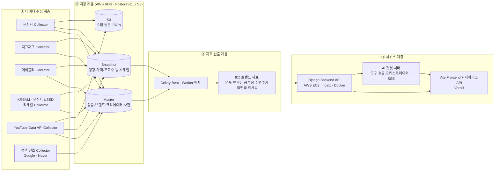
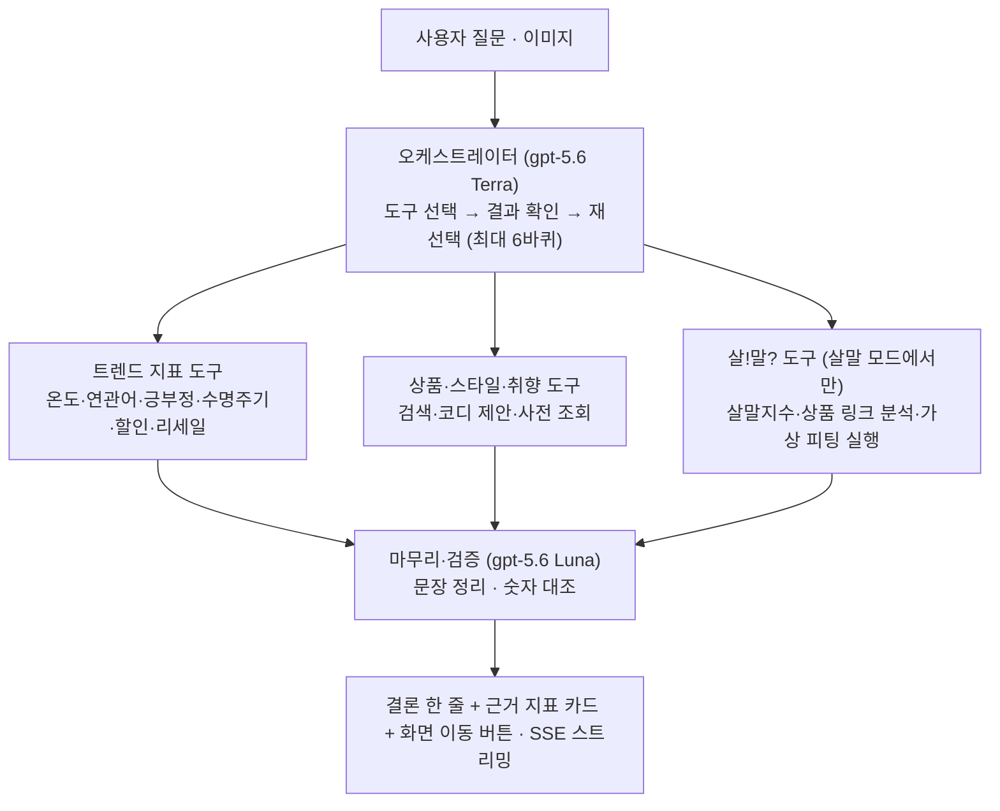
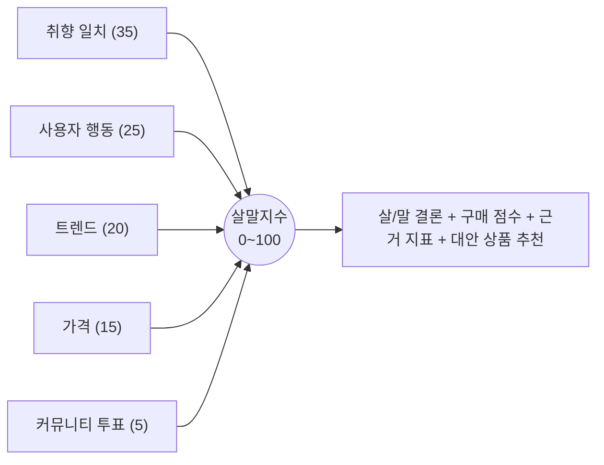
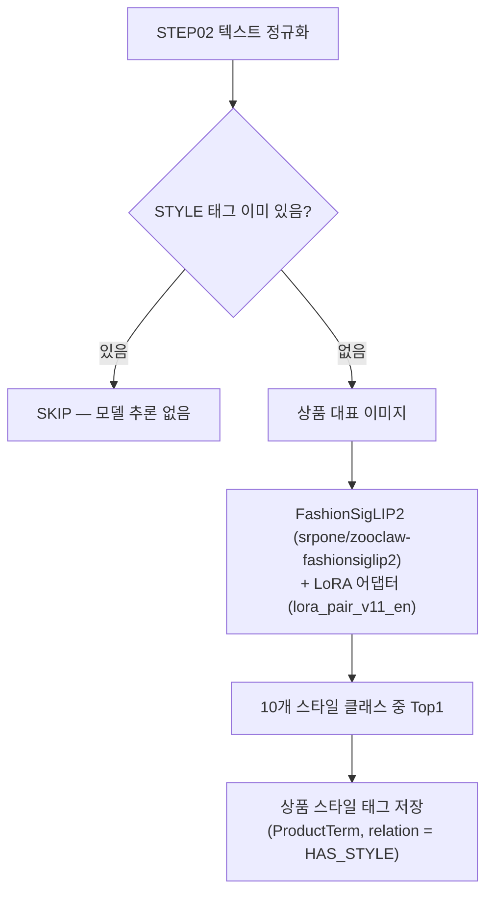
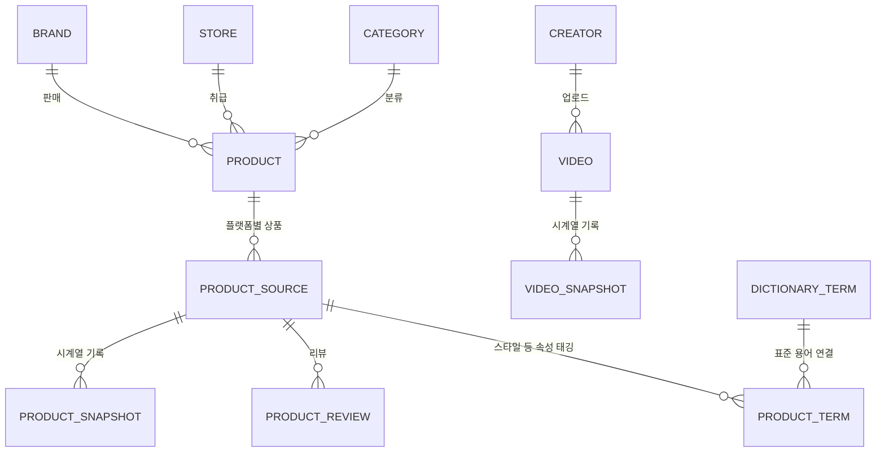

<div align="center">


# FEEDiT
### [FEEDiT - 배포 링크](https://fee-di-t-frontend.vercel.app/)

**패션 트렌드를 물어보고, 분석하고, 결정한다. 나만의 스타일 컨설팅 AI**

커머스·유튜브·검색 데이터를 모아 6개 트렌드 지표로 계산하고, AI 챗봇이 지표를 해석해주며,   
살까 말까 고민되는 상품은 커뮤니티 투표로 정하고 가상 피팅으로 입어볼 수 있는 AI 기반 패션 트렌드 플랫폼


</div>

---

## 목차

1. 팀 소개
2. 프로젝트 개요
3. 핵심 기능
4. 기술 스택
5. 시스템 아키텍처
6. 핵심 기술 상세
7. 데이터 설계
8. 배포 정보 및 실행 방법

---

## 1. 팀 소개

| 유진영 | 고현아 | 김봉남 | 안혁진 | 전서연 |
| :---: | :---: | :---: | :---: | :---: |
| [GitHub](https://github.com/ujneg18-source) | [GitHub](https://github.com/hellene0708-cyber) | [GitHub](https://github.com/bongrybong) | [GitHub](https://github.com/Jinxxxok) | [GitHub](https://github.com/sxoxyn) |
| <b>PM</b> | <b>BE</b> | <b>BE</b> | <b>FE</b> | <b>FE</b> |

---

## 2. 프로젝트 개요

### **프로젝트명** : FEEDiT

**FEEDiT**은 무신사·에이블리·지그재그·KREAM 등 국내 주요 패션 커머스와 패션 유튜브 콘텐츠, 검색 데이터를 수집·분석하여, 지금 어떤 스타일과 아이템이 뜨고 있는지를 트렌드 지표로 보여주고, AI 챗봇을 통해 "이거 사도 될지" 판단을 도와주는 LLM 기반 서비스입니다. 가격과 트렌드의 **근거를 함께 보여주는 것**이 핵심입니다.

단순히 트렌드를 소개하는 것을 넘어, 사용자의 취향·체형·행동 데이터를 기반으로 개인화된 트렌드 브리핑과 구매 의사결정 조언을 제공하고, 살까 말까 고민되는 상품을 다른 사용자와 함께 투표하는 커뮤니티 기능(살!말?)과 AI 가상 피팅까지 하나의 서비스 안에서 제공합니다.

```
[커머스/유튜브/검색 데이터 수집] → [6종 트렌드 지표 산출] → [AI 챗봇 · 내 피드 개인화 안내]
                                                              └→ [살!말? 커뮤니티 투표 · 구매 결정 · 가상 피팅]
                                                                        └→ [투표·만족도 데이터를 다시 개인화 추천에 반영]
```

### 2-1. 개발 배경

패션 트렌드는 하루가 다르게 변하지만, 일반 소비자가 이를 객관적인 데이터로 파악하기는 어렵습니다. FEEDiT은 누구나 한 번쯤 겪어본 쇼핑 과정의 4가지 고민에서 출발했습니다.

**기존 패션 쇼핑의 한계**

1) **감에 의존하는 트렌드** : "요즘 뜬다"는 말은 많지만, 실제 언급량이 얼마나 늘었는지, 유행의 정점을 지났는지 숫자로 보여주는 곳이 없습니다.

2) **구매 직전의 망설임** : "지금 사면 유행 끝물은 아닐까?", "나중에 더 싸지지 않을까?" 결제를 앞두고 판단할 명확한 근거가 부족합니다.

3) **파편화된 정보** : 가격과 할인율은 쇼핑몰에, 화제성은 유튜브나 SNS에, 리셀 시세는 별도 앱에 흩어져 있어 한눈에 비교하기 번거롭습니다.

4) **단절된 쇼핑 경험** : 큰맘 먹고 산 옷이 만족스러웠는지 피드백이 남지 않아, 다음 쇼핑에서도 나에게 최적화된 추천을 받기 어렵습니다.

💡 **FEEDiT의 해결책** : 데이터 선순환 구조  
FEEDiT은 감이 아닌 '데이터'로 의사결정을 돕습니다. 흩어진 커머스와 콘텐츠 데이터를 모아 정량적 지표로 변환하고, AI 챗봇과 커뮤니티 투표(살!말?)로 구매 고민을 명쾌하게 해결합니다. 나아가 구매 후 만족도를 다시 알고리즘에 반영해, 쓸수록 내 취향에 맞춰 똑똑해지는 쇼핑 경험을 제공합니다.

---

## 3. 핵심 기능

| 기능 영역 | 설명 | 핵심 기술 |
|---|---|---|
| **AI 챗봇** | 일반(트렌드 분석·컨설팅) 모드와 살!말? 판정 모드 2종. 멀티모달(이미지) 입력, SSE 스트리밍 응답, 대화 기록·맥락 기억, 취향 기반 개인화 답변. 지표·가격·상품 URL은 모델이 만들지 않고 데이터 도구의 결과만 사용 | 도구 호출형 오케스트레이터(역할별 OpenAI 모델) + 데이터 도구 |
| **가상 피팅 (VTON)** | 살!말? 모드에서 상품 사진을 FEEDiT 모델(여성/남성)에 입혀보는 AI 이미지 생성. 일반 모드에서는 코디 제안까지, 실제 피팅 실행은 살!말? 모드에서 지원 | GPT Image 2.5 (Sunburst · Flare), 코디 인계 도구 |
| **트렌드 지표 (EDIT)** | 언급량·트렌드 온도, 연관어(5축), 긍부정(구매의향), 수명주기, 할인률 변화, 리세일 시세 지수 등 6개 탭. 지표 공유(PNG)·다운로드(엑셀/PDF/이미지) 지원 | 일배치 스케줄러(Celery) + Commerce/Content Snapshot 집계 |
| **내 피드 (FEED)** | 취향 브리핑, 취향 맞춤 살!말? 큐레이션, 금주의 리포트(PNG 공유·엑셀/PDF/이미지 다운로드), 찜한 키워드 상태 변화 | 사용자 행동 로그 기반 개인화 |
| **패션 검색** | 패션 전용 사전 기반 키워드 검색, 최근 검색어, 스타일·브랜드·종류·아이템 단계별 세부 검색 | 패션 사전(Lexicon) · 카테고리 체계 |
| **살!말?** | 고민 상품 등록 후 실시간 투표(살/말)와 댓글, 인기순·최신순·마감임박·내취향 정렬, 등록 후 48시간 자동 마감, 마감 후 작성자에게 결과 피드백(구매 여부·만족도) 요청, 신고 | 투표 처리, 취향 매칭, 살말지수(5개 요소 가중 합산) |
| **스타일** | 코어 5종(고프코어·블록코어·바이크코어·놈코어·애슬레저) + 원형 5종(클래식·아메카지·그런지·페미닌·스트릿웨어), 총 10종의 핵심 스타일 조회 및 스타일별 상세(기원·확산 계기·핵심 키워드). '이 스타일의 아이템'에는 FashionSigLIP2 + LoRA로 해당 스타일이 자동 태깅된 상품이 노출됨 | 스타일별 상세 콘텐츠 + 자동 태깅 결과 연동 |
| **계정·알림** | 이메일 인증 가입, Google·카카오 로그인, 프로필·경험치(XP)·레벨, 찜 변동·일간·주간 리포트 알림, 관리자 실시간 공지 | 계정/알림 API, Celery beat 정기 알림 |
| **요금제** | 프리 / 프로 / 비즈니스 3단계. 프리는 챗봇 하루 20회·EDIT 언급량·온도만, 프로는 EDIT 6탭 전체·리포트 내보내기·챗봇 확대, 비즈니스는 여기에 데이터 API 연동 포함. 프로·비즈니스는 신청 후 운영자 승인(결제 미연동, 공개 베타 중에는 제한 미적용) | 권한 기반 API 제어(서버에서 잠긴 지표 응답 제외) |
| **데이터 API** | 비즈니스 요금제 전용. API 키(계정당 최대 5개)로 트렌드·검색·연관어·긍부정·수명주기·할인률·리세일 지표를 JSON으로 조회. 키당 분당 60회·계정당 하루 10,000회 기본 한도 | `/api/data/<지표>`, 키 해시 저장 |
| **도움말 허브** | 모든 페이지에서 쓸 수 있는 도움말 메뉴와 독립형 온보딩 가이드 | 전역 도움말 허브(`assistant_hub`) |
| **관리자(Admin)** | 수집 대상·실행 이력·원본 문서 조회, 정규화 실패·데이터 품질 점검, 사전·후보어·브랜드 매핑 관리, 서비스 운영(피드백·신고·회원·투표·댓글), 알림·실시간 공지 발송, 지표 재계산, 미갱신 소스 운영 알림. 팀 이메일 허용 목록 + OTP(TOTP) 인증 + 60분 유휴 세션 | 수집 파이프라인 모니터링 대시보드(`/admin-dashboard/`) |
| **AI 자동 태깅 파이프라인** | 상품 대표 이미지에 대한 스타일 자동 분류 (스타일 태그가 없는 상품 대상) | FashionSigLIP2 + LoRA(Top1) |

---

## 4. 기술 스택

| 구분 | 기술 |
|---|---|
| **Frontend** |    |
| **Backend** |     |
| **AI / LLM** |  (챗봇: gpt-5.6 Terra·Luna·Sol 역할별 사용 / 텍스트 분석: gpt-6-luna / 가상 피팅: GPT Image 2.5) |
| **Data Collection** |   + Google Trends · Naver DataLab/SearchAd(검색 신호) |
| **ML / Auto-Tagging** | FashionSigLIP2(`srpone/zooclaw-fashionsiglip2`) + LoRA 어댑터(PEFT) · EasyOCR · YOLO/ONNX · Transformers/PyTorch |
| **Database** |  (pgvector 사용) ·  (수집 원본 보관) |
| **Infrastructure** |     |
| **Collaboration** |   |

> 프론트엔드는 Vite 기반 Vanilla JavaScript 정적 SPA(+ Vercel 서버리스 함수)로 Backend와 독립적으로 빌드·배포됩니다. 백엔드는 Django API와 Python 표준 HTTP 서버 기반 챗봇 서버로 분리되어 EC2에서 Docker Compose로 실행되고, DB는 AWS RDS(PostgreSQL)를 사용합니다. 버전은 저장소의 선언·잠금 파일 기준입니다.

---

## 5. 시스템 아키텍처

FEEDiT은 **데이터 수집 → 저장 → 지표 산출 → 서비스 제공**의 4단계 파이프라인으로 구성됩니다.



**요청 경로** : 브라우저 → Vercel(정적 번들·서버리스 함수) → EC2 nginx(`/api/` → Django, `/v1/` → 챗봇) → AWS RDS. 챗봇은 RDS 조회와 Django 도구 호출, 외부 언어·이미지 모델 API 호출을 조합해 SSE로 응답합니다.

> 챗봇·가상 피팅은 외부 모델 API 호출 경로로 구현되어 있으며, 별도 GPU 추론 서버의 상시 운영은 이 저장소만으로는 확인되지 않습니다. 상세 구성은 `docs/ARCHITECTURE.md`를 참고하세요.

---

## 6. 핵심 기술 상세

### 6-1. AI 챗봇 — 도구 호출형 오케스트레이터

질문마다 의도를 정규식으로 미리 확정하지 않고, **오케스트레이터가 다음에 부를 도구를 고르고 → 결과를 보고 다시 고르는** 방식으로 동작합니다. 지표·가격·상품 URL 같은 값은 항상 데이터 도구의 결과만 사용하며, 모델이 숫자를 만들지 않도록 검증 단계(`verify`)에서 대조합니다.



- **역할별 모델 분리** : 도구 선택·해석·살!말? 결론 등 판단이 필요한 자리에는 중간 모델(Terra), 분류·발췌·숫자 대조·형식 정리처럼 출력이 닫혀 있는 자리에는 작은 모델(Luna)을 사용합니다. 호출이 실패하거나 결과가 깨졌을 때만 큰 모델(Sol)로 한 번 더 시도합니다. 모델 식별자는 `ChatBot/app/llm.py`와 환경변수가 기준입니다.
- **안전장치** : 최대 바퀴 수, 같은 인자 재호출 금지, 전체 시간 예산, 도구 결과 원본 보관(검증용).
- **모드 경계는 도구 목록으로 관리** : 일반 모드에는 가상 피팅 실행 도구가 없고 제안(`propose_fit`)까지만 있습니다. 살!말? 모드에서만 피팅 실행 도구가 열립니다.
- **일반 모드** : 트렌드 분석 → 취향분석/상품추천/트렌드지표, 코디 제안
- **살!말? 모드** : 구매 판단·상품 비교·코디 인계·가상 피팅. 트렌드·가격·취향을 결합한 **살말지수**를 산출해 조언하고, 고민이 더 필요하면 살!말? 커뮤니티 등록으로 유도

### 6-2. 트렌드 지표 산출 — 데이터 소스 · 산출 방식

각 지표는 Commerce/Content Snapshot과 텍스트 신호(리뷰·댓글) 데이터를 기반으로 아이템·스타일·카테고리·브랜드 태그 단위로 계산됩니다.

| 지표 | 주요 데이터 소스 | 산출 방식 개요 |
|---|---|---|
| 언급량 · 트렌드 온도 | Commerce/Content 반응 데이터, 월간 검색량 | 소스·신호별로 직전 28일 기준 백분위로 정규화한 뒤 Presence·Attention·Engagement·Intent 4개 의미 축으로 합산해 Level(수준)을 만들고, 7일 대비 28일 변화인 Momentum과 합쳐 **온도 = Level 60% + Momentum 40%** (0~100)로 환산. 반응률은 소표본 왜곡을 막기 위해 경험적 베이즈 수축 적용 |
| 연관어 (5축) | 리뷰·댓글 텍스트 | 같은 글에서 함께 언급된 단어를 아이템·소재·컬러·핏·상황 5개 축으로 집계, 연관도 점수·전주 대비 증감 산출 |
| 긍부정 (구매의향) | 리뷰·댓글 텍스트(LLM 구조화 분석 + 원문 근거 위치 검증) | 단순 감정이 아닌 구매의향 기준으로 분류. 커머스 리뷰와 유튜브 댓글을 함께 반영하며, 소표본은 수축(shrinkage)으로 보정 |
| 수명주기 | 온도 지표의 Level · Momentum | 28일 이동평균의 관측 최고점 대비 위치와 모멘텀으로 **태동·확산·정점·쇠퇴** 4단계를 규칙 기반으로 판정(관측 28일 미만이면 판단 보류). 단계에 따라 발주 적기/주의/비추천 판별 제공 |
| 할인률 변화 | Commerce Snapshot(가격·할인율) | 정가·판매가·할인율을 시점별로 기록해 최저가 시점과 할인 패턴 계산 |
| 리세일 시세 지수 | 중고·리셀 플랫폼 시세(KREAM, 무신사 USED) | 정가 대비 중고가 비율(가치 유지율)로 프리미엄/디스카운트 여부 산출. 표준상품에 매핑된 상품은 플랫폼 간 가격을 함께 비교하고, 매핑되지 않은 상품은 플랫폼 단독 상품으로 표시 |

> 없는 수치·관측치 부족·추정값은 화면과 챗봇에서 구분해 표시하며, 데이터가 없는 항목을 0으로 채우지 않습니다.

### 6-3. 살!말? 지수 산출

살말지수는 추천 그 자체가 아니라 **판단 보조 지표**입니다. 점수가 없는 축은 50점으로 메우지 않고 분모에서 제외하며, 근거 데이터가 부족하면(coverage 낮음) 같은 점수라도 낮은 신뢰도로 표시합니다. 커뮤니티 투표는 다른 사람의 의견이므로 전체의 5%만 반영합니다.



### 6-4. 패션 이미지 자동 스타일 태깅 파이프라인

상품 이미지에 스타일 태그를 자동 부여하는 파이프라인으로, 텍스트 정규화(STEP02) 이후 **스타일 태그가 없는 상품만** 대상으로 **FashionSigLIP2 + LoRA** 모델이 대표 이미지를 분석합니다.



- **분류 클래스** : 고프코어·그런지·놈코어·바이크코어·블록코어·스트릿웨어·아메카지·애슬레저·클래식·페미닌 (10종)
- **정책** : STYLE이 이미 있는 상품과 대표 이미지가 없는 상품은 건너뛰고, Top1 한 개만 사용합니다. 기존 ProductTerm과 정규화 속성은 수정·삭제하지 않습니다.
- **학습·추론** : 학습 시 사용한 영문 설명 프롬프트(`lora_pair_v11_en.csv`)를 운영 추론에서도 동일하게 사용하며, 모델과 고정 텍스트 임베딩은 프로세스당 한 번만 로드합니다. 대량 백필은 CLI(`pipeline.step03_vision.backfill`)로 수행합니다.
- **서비스 연동** : 이렇게 태깅된 스타일 태그는 스타일 페이지의 '이 스타일의 아이템' 영역에 반영되어, 각 스타일별로 해당 태그가 붙은 상품이 노출됩니다.

---

## 7. 데이터 설계

### 7-1. Commerce / Content — Master · Snapshot 구조

| 데이터 영역 | 구분 | 주요 수집 대상 | 제공 가치 |
|---|---|---|---|
| Commerce | Master | 상품, 브랜드, 스토어, 카테고리, 상품 URL, 이미지 | 상품·브랜드·스토어 기준 정보 구성 |
| Commerce | Snapshot | 랭킹, 가격, 할인율, 리뷰 수, 좋아요·관심 지표, 중고·리셀 시세, 수집 시점 | 상품 인기 변화, 가격 변화, 급상승·하락 추적 |
| Content | Master | Creator(채널), Video, 제목, 게시일, 설명, 댓글 | 패션 콘텐츠와 크리에이터 구조 파악 |
| Content | Snapshot | 조회수, 좋아요, 댓글 등 반응 지표 | 콘텐츠 확산 속도와 패션 화제성 측정 |
| Analysis | 지표 | 텍스트 문서·용어 언급, 일별 용어 지표·연관 지표, 월간 검색 지표 | 6종 트렌드 지표와 챗봇 도구의 원천 |

RDS(PostgreSQL)는 용도별 스키마(`dictionary` / `collection` / `commerce` / `content` / `snapshot` / `analysis` / `app`)로 구성되며, 수집 원본 JSON은 S3에 보관하고 위치를 `collection.raw_document`에 기록해 분석 결과를 원본부터 재현할 수 있게 했습니다.



- **Commerce Master**는 무신사·지그재그·에이블리 랭킹을 기반으로 수집하며, 리세일 분석을 위해 KREAM·무신사 USED의 중고·리셀 시세도 함께 수집합니다. 상품은 플랫폼별 상품(`product_source`)과 FEEDiT 표준상품(`product`)으로 나뉘고, 표준상품에 매핑된 경우 플랫폼 간 가격을 함께 비교합니다.
- **Commerce Snapshot**은 랭킹·가격·할인율·리뷰·관심 지표처럼 시간에 따라 변하는 값만 Snapshot으로 저장해 상승·하락 방향과 변화 속도를 분석합니다.
- **Content**는 국내 패션 유튜브 크리에이터 채널의 영상과 댓글을 대상으로 하며, 채널을 일일 갱신해 신규 영상과 조회수·좋아요·댓글 등 반응 데이터를 누적합니다.
- **검색 신호**는 Google Trends·Naver DataLab/SearchAd 기반의 일간·주간·월간 검색 데이터를 정기 수집해 온도 지표와 챗봇에 반영합니다.
- **사전(Lexicon)** : 스타일·아이템·소재·컬러·TPO·브랜드 등 표준 용어와 별칭을 관리하며, 미등록 후보어는 관리자 승인 후 사전에 등재됩니다.

### 7-2. 수집 아키텍처 원칙

FEEDiT의 수집 시스템은 플랫폼별 Collector를 독립적으로 운영하고, 공통 처리 과정과 저장 계층을 공유하는 구조입니다. 플랫폼별 페이지·API 구조가 달라도 Collector 내부에서 흡수하도록 분리해, 한 플랫폼의 변경이 다른 Collector에 영향을 주지 않도록 설계했습니다.

- **Commerce** : 무신사·지그재그·에이블리·KREAM·무신사 USED Collector를 독립 운영, 요청 간 딜레이 적용 (Playwright·API 기반)
- **Content** : YouTube Data API v3 활용
- **검색 신호** : Google Trends · Naver DataLab · Naver SearchAd

### 7-3. 정기 작업 (Celery Beat · Asia/Seoul)

| 시각 | 작업 |
|---|---|
| 60초마다 | 수집 대상(CrawlTarget) 확인·실행 |
| 매일 04:10 | 텍스트 신호 수집·분석·35일 지표 재계산 |
| 매일 05:30 | 검색 신호 일간 수집 |
| 월–금 06:10 | 검색 신호 주간 수집 |
| 매월 2일 06:40 | 검색량 월간 수집 |
| 매일 09:20 | 장기 미갱신 소스 운영 알림 |
| 매일 10:00 | 일간 알림 (찜 상품 가격 하락 등) |
| 일요일 18:00 | 주간 트렌드 리포트 알림 |

---

## 8. 배포 정보 및 실행 방법

### 8-1. 배포 URL

| 구분 | URL |
|---|---|
| 🌐 Frontend (배포) | https://fee-di-t-frontend.vercel.app/ |
| 🖥 Backend | AWS EC2 (nginx 프록시 뒤 Django API · 챗봇 서버, 공개 URL은 Vercel 서버리스 함수가 중계) |

### 8-2. 로컬 실행법

**1. 저장소 준비**

```bash
git clone https://github.com/feedit-official/feedit.git
cd feedit
cp .env.example .env   # 실제 값은 팀의 환경 관리 절차로 채웁니다 (.env는 커밋 금지)
```

**2. Frontend** (Node 20 계열)

```bash
cd frontend
nvm use
npm ci
npm run dev
```

http://localhost:5173 에서 열립니다. `/api`는 Django(기본 8000), `/api/v1`은 챗봇(8770)으로 프록시됩니다.

**3. Backend (Django API · Redis · 챗봇) — Docker**

Docker Desktop을 먼저 켠 뒤, 프로젝트 루트에서 실행합니다.

```powershell
docker compose --env-file .env -f docker/compose.yml up --build
```

- Django API: http://localhost:8000 (관리자 대시보드는 http://localhost:8000/admin-dashboard/)
- 챗봇 서버: http://localhost:8770

**종료**

```powershell
docker compose --env-file .env -f docker/compose.yml down
```

> 로컬 Compose는 Django + Redis + 챗봇을 실행하며, DB는 AWS RDS(PostgreSQL)를 사용합니다. 사설 RDS에 접근해야 하면 `--profile tunnel`로 AWS SSM Tunnel을 함께 띄웁니다(AWS 권한 필요). 데이터 기능 검증에는 RDS 접속 정보와 `OPENAI_API_KEY` 등 환경값이 필요합니다.

**테스트**

```bash
# frontend 폴더
npm run build && npm test
# 저장소 루트
PYTHONPATH=ChatBot python -m unittest discover -s ChatBot/tests -p 'test_*.py'
# backend 폴더 (pgvector가 있는 빈 Postgres 필요)
python manage.py test apps
```

GitHub Actions(`.github/workflows/ci.yml`)가 main 푸시와 PR마다 위 세 영역의 검증을 수행합니다(배포는 하지 않음).

### 8-3. 운영 배포 요약

- **Frontend** : Vercel (Root `frontend`, Vite, Output `dist`). `BACKEND_API_URL`·`CHAT_BACKEND_URL` 등 환경변수로 백엔드를 연결합니다.
- **Backend** : EC2에서 API(`docker/compose.api.yml`: API·Redis·worker·beat)를 먼저, 챗봇(`docker/compose.chat.yml`)을 다음에 띄웁니다. 스키마 변경은 기동 명령과 분리된 별도 마이그레이션 작업입니다.
- **요금제 적용** : `FEEDIT_PUBLIC_BETA` 기본값은 1(공개 베타)이며, 0으로 바꾸고 API·챗봇을 함께 재기동하면 요금제 제한과 데이터 API가 활성화됩니다.

자세한 절차는 `docs/DEPLOYMENT.md`, `docs/DEVELOPMENT.md`, 데이터 API 사용법은 `docs/DATA_API.md`를 참고하세요.

---


<div align="center">

**FEEDiT** — SK네트웍스 Family AI 31기 4팀

</div>
