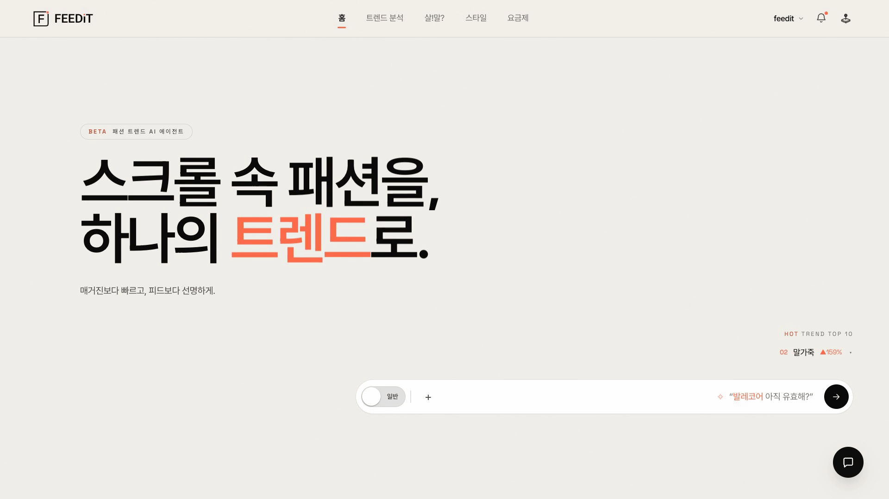
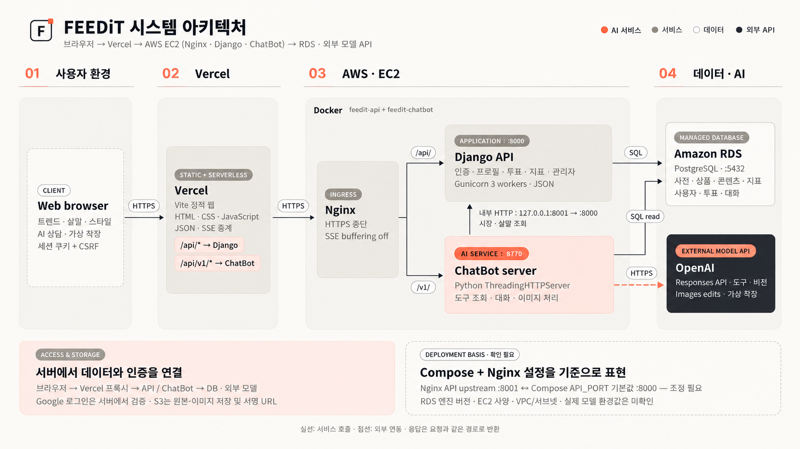
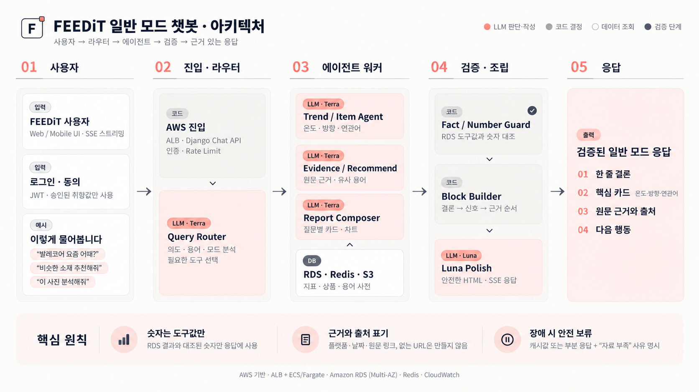
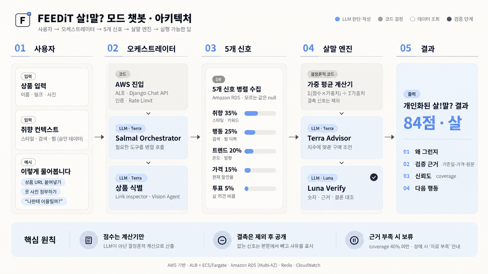

  

[서비스 바로가기](https://fee-di-t-frontend.vercel.app/)

---

## 목차

1. [팀 소개](#1-팀-소개)
2. [프로젝트 소개](#2-프로젝트-소개)
3. [핵심 기능](#3-핵심-기능)
4. [구현 화면](#4-구현-화면)
5. [기술 스택](#5-기술-스택)
6. [디렉터리 구조](#6-디렉터리-구조)
7. [아키텍처](#7-아키텍처)
8. [데이터와 지표](#8-데이터와-지표)
9. [로컬 실행](#9-로컬-실행)
10. [문서](#10-문서)

---

## 1. 팀 소개

| 유진영 | 고현아 | 김봉남 | 안혁진 | 전서연 |
| :---: | :---: | :---: | :---: | :---: |
|  |  |  |  |  |
|  |  |  |  |  |
| <b>PM · 총괄</b> | <b>DB · Backend</b> | <b>DB · Backend</b> | <b>Frontend · AI Agent</b> | <b>Frontend · AI Agent</b> |

---

## 2. 프로젝트 소개

FEEDiT은 흩어진 패션 커머스·콘텐츠·검색 데이터를 모아 지금 주목받는 스타일과 아이템을 보여줍니다.
사용자는 트렌드 지표를 확인하고, AI 챗봇과 커뮤니티의 도움을 받아 구매를 판단할 수 있습니다.

### 2.1 해결하려는 문제

- **감에 의존하는 트렌드 판단**: 언급과 관심의 변화를 숫자로 확인하기 어렵습니다.
- **흩어진 구매 정보**: 가격, 콘텐츠 반응, 리세일 시세가 서로 다른 서비스에 있습니다.
- **구매 직전의 망설임**: 내 취향과 현재 트렌드를 함께 고려한 근거가 부족합니다.

FEEDiT은 데이터를 수집해 지표로 만들고, 그 결과를 챗봇·살!말? 투표·개인화 피드에 연결합니다.

## 3. 핵심 기능

| 기능 | 사용자가 할 수 있는 일 |
| --- | --- |
| **트렌드 분석** | 6종 지표로 스타일·아이템의 현재 흐름과 변화를 살펴봅니다. |
| **AI 챗봇** | 일반 모드에서 트렌드·스타일을 묻고, 살!말? 모드에서 구매 조언을 받습니다. |
| **살!말? 커뮤니티** | 고민 상품을 공유하고 투표와 댓글로 다른 사람의 의견을 확인합니다. |
| **가상 피팅** | 상품 이미지를 FEEDiT 모델에 적용해 착용 모습을 미리 봅니다. |
| **내 피드** | 취향과 활동을 반영한 브리핑·추천을 확인합니다. |

## 4. 구현 화면

홈 → 내 피드 → 언급량·트렌드 온도 → 살!말? → 스타일 → AI 챗봇 → 가상 피팅 순서로 주요 화면을 보여줍니다.

화면별 구성과 동작은 [화면설계서](outputs/%5B%EB%AA%A8%EB%8D%B8_%EB%B0%B0%ED%8F%AC%5D%ED%99%94%EB%A9%B4%EC%84%A4%EA%B3%84%EC%84%9C_31%EA%B8%B0_4%ED%8C%80)를 참고하세요.

## 5. 기술 스택

| 구분 | 주요 기술 | 역할 |
| --- | --- | --- |
| **Frontend** |    | 화면, 차트, 채팅 UI와 정적 웹 배포 |
| **Backend** |     | 서비스 API와 서버 운영 |
| **AI & LLM** |        | 챗봇·가상 피팅·상품 스타일 태깅 |
| **Data** |    | 데이터 저장·분석과 이미지 객체 관리 |
| **Operating System** |   | Ubuntu 기반 GitHub Actions 자동 검증 환경 |

**챗봇 모델 구성** — 아래는 기본 설정이며, 환경변수로 변경할 수 있습니다.

| 모드 | 판단·도구 선택 | 분류·검증·정리 | 실패 시 재시도 |
| --- | --- | --- | --- |
| **일반 모드** | `gpt-5.6-terra` | `gpt-5.6-luna` | `gpt-5.6-sol` |
| **살!말? 모드** | `gpt-5.6-terra` (구매 판단 포함) | `gpt-5.6-luna` | `gpt-5.6-sol` |

**가상 피팅**은 `gpt-image-2.5-sunburst` 또는 `gpt-image-2.5-flare`, **텍스트 신호 분석**은 `gpt-6-luna`를 사용합니다.

운영 요청은 Vercel에서 EC2의 Django API 또는 챗봇 서버로 전달됩니다.
서비스 구성과 구현 내용은 [시스템 구성도](outputs/%5B%EB%AA%A8%EB%8D%B8_%EB%B0%B0%ED%8F%AC%5D%EC%8B%9C%EC%8A%A4%ED%85%9C_%EA%B5%AC%EC%84%B1%EB%8F%84_31%EA%B8%B0_4%ED%8C%80.docx)와 [웹 애플리케이션 문서](outputs/%5B%EB%AA%A8%EB%8D%B8_%EB%B0%B0%ED%8F%AC%5D%EA%B0%9C%EB%B0%9C%EB%90%9C_LLM_%EC%97%B0%EB%8F%99_%EC%9B%B9_%EC%95%A0%ED%94%8C%EB%A6%AC%EC%BC%80%EC%9D%B4%EC%85%98_%EB%AC%B8%EC%84%9C_31%EA%B8%B0_4%ED%8C%80.docx)를 참고하세요.

## 6. 디렉터리 구조

주요 서비스 폴더만 펼쳐 표시했습니다. 빌드 결과와 가상환경은 제외했습니다.

~~~text
SKN31-FINAL-4Team/
├── frontend/                        # Vite 웹 화면과 Vercel 서버리스 함수
│   ├── api/                         # 백엔드·챗봇 API 중계
│   ├── core/                        # 공통 화면 자산과 유틸리티
│   ├── trend/                       # 트렌드 지표 화면
│   └── salmal/                      # 살!말? 커뮤니티 화면
├── backend/                         # Django API와 데이터 처리
│   ├── config/                      # Django·Celery 설정
│   ├── apps/                        # 서비스 API·모델·관리자 기능
│   └── pipeline/                    # 수집부터 지표 산출까지의 파이프라인
│       ├── step01_ingestion/        # 플랫폼별 데이터 수집
│       ├── step02_normalization/    # 상품·용어 정규화
│       ├── step03_vision/           # 이미지 기반 스타일 태깅
│       └── step04_metrics/          # 트렌드 지표 계산
├── ChatBot/                         # 챗봇 서버와 AI 에이전트
│   ├── app/                         # 오케스트레이션·도구·응답 검증
│   ├── vendor/                      # 질문 추출기와 패션 사전
│   └── tests/                       # 챗봇 테스트
├── outputs/                         # 최종 산출 문서·화면 설계·README 이미지
├── docs/                            # 개발·배포 등 내부 설명 문서
├── .github/                         # CI 워크플로
├── requirements.txt                 # 데이터 수집·분석 Python 의존성
└── .env.example                     # 환경변수 예시
~~~

## 7. 아키텍처

### 7.1 시스템 아키텍처

브라우저는 Vercel에서 웹 화면을 받고, 서버 요청은 EC2의 nginx를 거쳐 Django API 또는 챗봇으로 전달됩니다.
Django는 RDS의 서비스 데이터를 읽고 쓰며, 챗봇은 데이터 도구와 외부 모델 API를 조합해 응답합니다.

- **Vercel**: 정적 화면 제공과 서버리스 함수의 API 중계
- **Django API**: 인증, 프로필, 지표, 투표, 관리자 기능
- **챗봇 서버**: 대화 처리, 도구 호출, 이미지 처리, 스트리밍 응답
- **RDS·S3**: 서비스 데이터와 수집 원본·이미지 객체 저장

### 7.2 챗봇 · 일반 모드

일반 모드는 질문의 의도를 파악한 뒤 필요한 데이터 도구와 에이전트를 선택합니다.
트렌드·상품·스타일 정보를 모아 숫자와 근거를 확인하고, 결론과 다음 행동을 답변으로 조립합니다.

- **질문 라우팅**: 질문 유형과 필요한 도구 선택
- **정보 수집**: 트렌드 지표, 상품, 스타일, 취향 데이터 조회
- **검증·조립**: 숫자 대조 후 근거와 출처를 포함한 답변 생성

### 7.3 챗봇 · 살!말? 모드

살!말? 모드는 상품과 취향 정보를 받아 다섯 신호를 병렬 수집합니다.
살말지수는 코드로 계산하고, 챗봇은 점수의 이유와 부족한 근거를 설명합니다.

- **입력**: 상품 이름·링크·사진과 사용자의 승인된 취향 정보
- **계산**: 취향·행동·트렌드·가격·투표의 가중 평균
- **응답**: 살/말 조언, 검증 근거, 신뢰도, 다음 행동

## 8. 데이터와 지표

### 8.1 데이터가 흐르는 방식

| 단계 | 내용 |
| --- | --- |
| **수집** | 패션 커머스, 리세일 플랫폼, YouTube, 검색 신호를 각각 수집 |
| **정규화** | 플랫폼별 상품·용어를 FEEDiT의 표준 상품·패션 사전에 연결 |
| **저장** | 상품·브랜드 등 기준 정보와 가격·랭킹 등 시계열 기록을 분리 |
| **분석** | 정기 작업으로 지표를 계산하고 결과를 API와 챗봇 도구에 제공 |

상품·브랜드·카테고리 같은 기준 정보는 Master로, 가격·랭킹·조회수처럼 변하는 값은 Snapshot으로 관리합니다.
수집 원본은 S3에 보관해 분석 결과를 원본 데이터와 연결할 수 있도록 했습니다.

### 8.2 여섯 가지 트렌드 지표

| 지표 | 확인할 수 있는 것 |
| --- | --- |
| **언급량·온도** | 관심 수준과 최근 변화 방향 |
| **연관어** | 함께 언급되는 아이템·소재·컬러·핏·상황 |
| **구매의향** | 리뷰·댓글에서 드러난 긍정·부정 신호 |
| **수명주기** | 태동·확산·정점·쇠퇴 단계 |
| **할인율 변화** | 가격과 할인 흐름 |
| **리세일 시세** | 정가 대비 중고·리셀 가치 |

수치가 없는 항목을 임의의 0으로 채우지 않습니다.
관측이 부족하거나 추정된 값은 화면과 챗봇에서 구분해 표시합니다.

### 8.3 살말지수 계산 원칙

| 신호 | 기준 가중치 | 살펴보는 내용 |
| --- | ---: | --- |
| 취향 | 35% | 스타일·키워드와의 일치 |
| 행동 | 25% | 검색·찜 등 사용자 활동 |
| 트렌드 | 20% | 관심도와 변화 방향 |
| 가격 | 15% | 현재 가격·할인 정보 |
| 투표 | 5% | 커뮤니티의 살/말 의견 |

- 없는 신호는 50점으로 채우지 않고 계산 분모에서 제외합니다.
- 근거의 범위가 좁으면 낮은 신뢰도로 표시합니다.
- 지표·가격·상품 URL은 모델이 만들어내지 않고 데이터 도구의 결과를 사용합니다.
- 검증 단계에서 수치와 근거를 다시 대조합니다.

관련 산출물은 [수집 데이터 보고서](outputs/%5B%EB%8D%B0%EC%9D%B4%ED%84%B0_%EC%88%98%EC%A7%91_%EB%B0%8F_%EC%A0%80%EC%9E%A5%5D%EC%88%98%EC%A7%91_%EB%8D%B0%EC%9D%B4%ED%84%B0_%EB%B3%B4%EA%B3%A0%EC%84%9C_31%EA%B8%B0_4%ED%8C%80.docx)와 [데이터 전처리 결과서](outputs/%5B%EB%8D%B0%EC%9D%B4%ED%84%B0_%EC%88%98%EC%A7%91_%EB%B0%8F_%EC%A0%80%EC%9E%A5%5D%EB%8D%B0%EC%9D%B4%ED%84%B0_%EC%A0%84%EC%B2%98%EB%A6%AC_%EA%B2%B0%EA%B3%BC%EC%84%9C_31%EA%B8%B0_4%ED%8C%80.docx)를 참고하세요.

## 9. 로컬 실행

개발 기준은 Python 3.13과 Node.js 20 계열입니다.
아래 명령 블록은 각각 저장소 루트에서 시작합니다. 데이터 기능에는 별도의 RDS 접근 권한과 환경변수가 필요합니다.

### 9.1 환경 준비

~~~bash
cp .env.example .env
~~~

환경값은 팀의 관리 절차에 따라 채웁니다. 비밀값을 저장소에 커밋하지 않습니다.

### 9.2 프론트엔드

~~~bash
cd frontend
nvm use
npm ci
npm run dev
~~~

개발 화면은 http://localhost:5173 에서 열립니다.

### 9.3 Django API

~~~bash
python3.13 -m venv .venv
source .venv/bin/activate
python -m pip install -r backend/requirements-api.txt
cd backend
python manage.py runserver 8000
~~~

API 기본 주소는 http://localhost:8000 입니다.
DB와 Redis는 이 명령으로 자동 실행되지 않습니다.

### 9.4 챗봇

~~~bash
source .venv/bin/activate
python -m pip install -r ChatBot/requirements.txt
python ChatBot/tools_env_check.py
cd ChatBot
python server.py
~~~

챗봇 기본 포트는 8770입니다. LLM 사용에는 공급자 접근 권한과 API 키가 필요합니다.
구현 및 검증 내용은 [웹 애플리케이션 문서](outputs/%5B%EB%AA%A8%EB%8D%B8_%EB%B0%B0%ED%8F%AC%5D%EA%B0%9C%EB%B0%9C%EB%90%9C_LLM_%EC%97%B0%EB%8F%99_%EC%9B%B9_%EC%95%A0%ED%94%8C%EB%A6%AC%EC%BC%80%EC%9D%B4%EC%85%98_%EB%AC%B8%EC%84%9C_31%EA%B8%B0_4%ED%8C%80.docx)와 [서비스 테스트 보고서](outputs/%5B%EB%AA%A8%EB%8D%B8_%EB%B0%B0%ED%8F%AC%5D%EC%84%9C%EB%B9%84%EC%8A%A4_%ED%85%8C%EC%8A%A4%ED%8A%B8_%EA%B3%84%ED%9A%8D_%EB%B0%8F_%EA%B2%B0%EA%B3%BC_%EB%B3%B4%EA%B3%A0%EC%84%9C_31%EA%B8%B0_4%ED%8C%80.docx)를 참고하세요.

## 10. 문서

최종 산출물은 저장소의 outputs 폴더에 있습니다.

| 구분 | 산출물 |
| --- | --- |
| **기획** | [프로젝트 기획서](outputs/%5B%EA%B8%B0%ED%9A%8D%5D%ED%94%84%EB%A1%9C%EC%A0%9D%ED%8A%B8_%EA%B8%B0%ED%9A%8D%EC%84%9C_31%EA%B8%B0_4%ED%8C%80.docx) · [요구사항정의서](outputs/%5B%EA%B8%B0%ED%9A%8D%5D%EC%9A%94%EA%B5%AC%EC%82%AC%ED%95%AD%EC%A0%95%EC%9D%98%EC%84%9C_31%EA%B8%B0_4%ED%8C%80.xlsx) |
| **데이터 수집·저장** | [수집 데이터 보고서](outputs/%5B%EB%8D%B0%EC%9D%B4%ED%84%B0_%EC%88%98%EC%A7%91_%EB%B0%8F_%EC%A0%80%EC%9E%A5%5D%EC%88%98%EC%A7%91_%EB%8D%B0%EC%9D%B4%ED%84%B0_%EB%B3%B4%EA%B3%A0%EC%84%9C_31%EA%B8%B0_4%ED%8C%80.docx) · [데이터 전처리 결과서](outputs/%5B%EB%8D%B0%EC%9D%B4%ED%84%B0_%EC%88%98%EC%A7%91_%EB%B0%8F_%EC%A0%80%EC%9E%A5%5D%EB%8D%B0%EC%9D%B4%ED%84%B0_%EC%A0%84%EC%B2%98%EB%A6%AC_%EA%B2%B0%EA%B3%BC%EC%84%9C_31%EA%B8%B0_4%ED%8C%80.docx) · [DB 스토리지 설계서](outputs/%5B%EB%8D%B0%EC%9D%B4%ED%84%B0_%EC%88%98%EC%A7%91_%EB%B0%8F_%EC%A0%80%EC%9E%A5%5DDB_%EC%8A%A4%ED%86%A0%EB%A6%AC%EC%A7%80%20%EC%84%A4%EA%B3%84%EC%84%9C_31%EA%B8%B0_4%ED%8C%80.docx) |
| **모델링·평가** | [AI 시스템 아키텍처](outputs/%5B%EB%AA%A8%EB%8D%B8%EB%A7%81_%EB%B0%8F_%ED%8F%89%EA%B0%80%5DAI_%EC%8B%9C%EC%8A%A4%ED%85%9C_%EC%95%84%ED%82%A4%ED%85%8D%EC%B2%98%28%EB%A9%80%ED%8B%B0_%EC%97%90%EC%9D%B4%EC%A0%84%ED%8A%B8_%EC%95%84%ED%82%A4%ED%85%8D%EC%B2%98%2931%EA%B8%B0_4%ED%8C%80.docx) · [학습한 ML·DL 모델](outputs/%5B%EB%AA%A8%EB%8D%B8%EB%A7%81_%EB%B0%8F_%ED%8F%89%EA%B0%80%5D%ED%95%99%EC%8A%B5%ED%95%9C_ML_DL_%EB%AA%A8%EB%8D%B8_31%EA%B8%B0_4%ED%8C%80.docx) · [벡터DB·GraphDB 구축 결과서](outputs/%5B%EB%AA%A8%EB%8D%B8%EB%A7%81_%EB%B0%8F_%ED%8F%89%EA%B0%80%5D%EB%B2%A1%ED%84%B0DB_GraphDB_%EA%B5%AC%EC%B6%95_%EA%B2%B0%EA%B3%BC%EC%84%9C_31%EA%B8%B0_4%ED%8C%80.docx) |
| **모델·배포** | [웹 애플리케이션 문서](outputs/%5B%EB%AA%A8%EB%8D%B8_%EB%B0%B0%ED%8F%AC%5D%EA%B0%9C%EB%B0%9C%EB%90%9C_LLM_%EC%97%B0%EB%8F%99_%EC%9B%B9_%EC%95%A0%ED%94%8C%EB%A6%AC%EC%BC%80%EC%9D%B4%EC%85%98_%EB%AC%B8%EC%84%9C_31%EA%B8%B0_4%ED%8C%80.docx) · [시스템 구성도](outputs/%5B%EB%AA%A8%EB%8D%B8_%EB%B0%B0%ED%8F%AC%5D%EC%8B%9C%EC%8A%A4%ED%85%9C_%EA%B5%AC%EC%84%B1%EB%8F%84_31%EA%B8%B0_4%ED%8C%80.docx) · [서비스 테스트 보고서](outputs/%5B%EB%AA%A8%EB%8D%B8_%EB%B0%B0%ED%8F%AC%5D%EC%84%9C%EB%B9%84%EC%8A%A4_%ED%85%8C%EC%8A%A4%ED%8A%B8_%EA%B3%84%ED%9A%8D_%EB%B0%8F_%EA%B2%B0%EA%B3%BC_%EB%B3%B4%EA%B3%A0%EC%84%9C_31%EA%B8%B0_4%ED%8C%80.docx) · [화면설계서](outputs/%5B%EB%AA%A8%EB%8D%B8_%EB%B0%B0%ED%8F%AC%5D%ED%99%94%EB%A9%B4%EC%84%A4%EA%B3%84%EC%84%9C_31%EA%B8%B0_4%ED%8C%80) |

SK네트웍스 Family AI 31기 · 4팀

